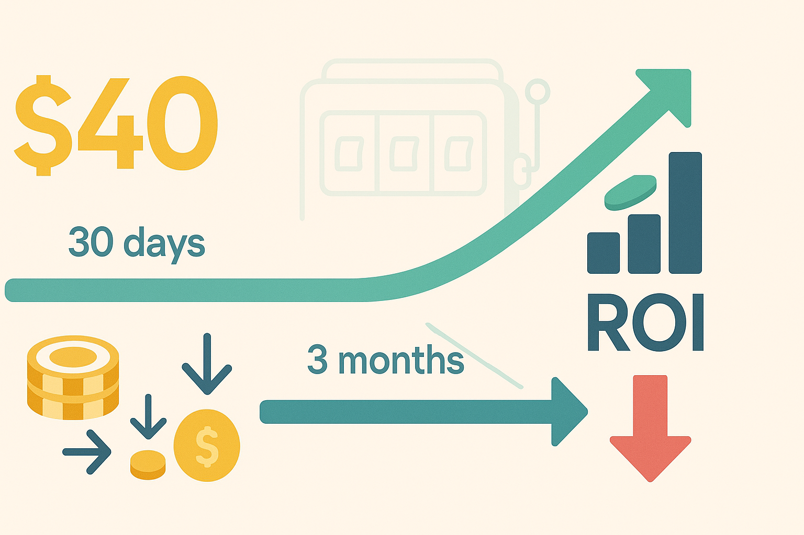

---
<div align="center">
  
</div>

# 🚀 MVP: Affiliate Traffic ROI (“CPA = \$40”)

---

## 📈 Overview

This project evaluates the **return on investment (ROI)** of affiliate-driven traffic for an i-gaming website. At a fixed cost-per-acquisition (CPA) of **\$40**, we ask:  
> **Does a newly acquired player “break even” within 3 months of registration?**  

- If **no**, the affiliate/source is flagged as **“inefficient”** and we recommend switching to a RevShare model or negotiating a lower CPA.  
- If **yes**, the CPA is validated and we focus on user retention.  

---

## 💼 Business Objective

- **CPA = \$40** per registered player.  
- Determine, using first‐month behavior, whether the player will generate at least \$40 net revenue within 3 months.  
- Flag unprofitable affiliates for payment‐scheme adjustment.

---

## 🗂️ Data

1. **Training Set (June 2024)**  
   - 30 days of activity per user  
   - File: `data.xlsx`  
2. **Validation Set (Hold-out)**  
   - Small subset of `data.xlsx`  
   - File: `data_2.xlsx`  

---

## 🔢 Feature Engineering (First 30 Days)

We construct the following metrics for each user:

| Feature           | Formula                                      | Meaning                                               |
|-------------------|----------------------------------------------|-------------------------------------------------------|
| **DaysToFTD**     | FTD_date − reg_date                         | Speed of first deposit (smaller is better)            |
| **days_active**   | lastBet − reg_date + 1                       | Number of active days in the first 30-day window      |
| **DepFreq**       | dep_num / days_active                        | Average deposits per active day                       |
| **Recency_days**  | 30 − (lastBet − reg_date)                    | Days since last bet (freshness measure)               |
| **Frequency**     | dep_num + withdrawal_num                     | Total number of money transactions                    |
| **FTD_Ratio**     | FTD_sum / dep_sum                             | Proportion of first deposit in total deposit volume   |
| **ChurnFlag_7d**  | [lastBet − reg_date < 23]                    | Did the user churn ≥7 days before window end?         |

> **Note:** Monetary features (`dep_sum`, `FTD_sum`, `withdrawal_sum`) are log‐transformed via  `x → log(1 + x)` to compress heavy tails.

---

## 🧮 ROI Mathematics

### 1️⃣ Net Revenue in Month 1 (Net1m)

\[
\text{Net1m} \;=\; \text{dep_sum} \;-\; \text{withdrawal_sum}
\]

This is the net cash flow generated by a user in the first 30 days.  

---

### 2️⃣ Project to 3-Month LTV (LTV₃m)

\[
\widehat{\text{LTV}}_{3m} \;=\; \frac{\widehat{\text{Net1m}}}{0.60}
\]

- **Why 0.60?**  
  - Industry studies of i-Gaming show that **Month 1 revenue** typically represents about **55–65%** of LTV₃m.  
  - Choosing 0.60 as a benchmark means any estimation error (at ±0.05) changes ROI by <9%, well within our model’s MAE ≈ \$5 ≪ CPA = \$40.  

---

### 3️⃣ Cost & ROI

- **Costᵢ = Nᵢ × CPA**  
  - Where Nᵢ is the number of new users acquired by affiliate i.  

- **ROIᵢ = ( LTV₃m − Costᵢ ) / Costᵢ**  

- If **ROI < 0** ⇒ Affiliate does **not** recover \$40 in 3 months ⇒ mark as **“inefficient”**.  
- If **ROI ≥ 0** ⇒ Traffic is profitable ⇒ keep CPA at \$40 and prioritize retention.  

> _Remark_: If we had full 3-month user data for training, we could refine the 0.60 factor. However, for an MVP, Month 1 suffices to predict 3-month outcomes.

---

## 🧩 Modeling Pipeline

### ⚙️ Classifier (Profitability)

- **Algorithm**: Gradient Boosting Classifier (250 trees, learning_rate=0.03, max_depth=2, subsample=0.6)  
- **Objective**: Estimate probability  
  \[
    p \;=\; \Pr(\text{Net1m} ≥ \$40)
  \]
- **Calibration**: Platt‐scaling (`CalibratedClassifierCV`) ⇒ Brier score ~0.02–0.05.  
- **Features**: All log‐transformed numeric features + engineered metrics + one-hot encoded categoricals.  
- **Validation**: GroupKFold (grouped by `aff_id` to prevent partner leaking).  

```python
# Classifier training snippet
from sklearn.pipeline import Pipeline
from sklearn.ensemble import GradientBoostingClassifier
from sklearn.calibration import CalibratedClassifierCV
from sklearn.metrics import roc_auc_score

pipe = Pipeline([
    ("prep", preproc_cls),  # preprocessing pipeline: imputation, scaling, encoding
    ("clf", GradientBoostingClassifier(
        n_estimators=250,
        learning_rate=0.03,
        max_depth=2,
        subsample=0.6,
        random_state=42
    ))
])

calib = CalibratedClassifierCV(pipe, cv=3, method="sigmoid")
calib.fit(X_train, y_train)

y_pred_proba = calib.predict_proba(X_val)[:, 1]
print("Hold-out AUC:", roc_auc_score(y_val, y_pred_proba))
```

## 🧮 Regressor (Net1m Amount)

**Algorithm**: Gradient Boosting Regressor (300 trees, max_depth=3, subsample=0.8)  
**Target**: log(Net1m + 1)

**Performance**:
- Hold-out MAE ≈ \$12.4 (R² ≈ 0.11)  
- External (unseen affiliates) MAE ≈ \$5.1 (R² ≈ 0.07)

```python
# Regressor training snippet
from sklearn.ensemble import GradientBoostingRegressor

reg_pipe = Pipeline([
    ("prep", preproc_reg),  # similar preprocessing for regression
    ("reg", GradientBoostingRegressor(
        n_estimators=300,
        learning_rate=0.03,
        max_depth=3,
        subsample=0.8,
        random_state=42
    ))
])

reg_pipe.fit(X_train, y_train_log_net1m)
y_pred = reg_pipe.predict(X_val)
```

## 📊 Model Performance

### Hold-Out Results

**Classifier**  
- AUC-ROC = 0.98  
- PR-AUC = 0.87  

**Regressor**  
- R² ≈ 0.11  
- MAE ≈ \$12.4  

<br>
<details>
<summary>🔍 Show hold-out ROC & PR curves</summary>

**ROC curve (hold-out)**: AUC = 0.98 — excellent separation of “profitable” vs. “unprofitable.”  

**Precision-Recall curve (hold-out)**: Precision ≥ 80% even at modest recall.  
</details>

---

### External (Unseen-Affiliate) Test

**Classifier**  
- AUC-ROC = 0.987  
- Brier = 0.022  

**Regressor**  
- R² ≈ 0.07  
- MAE ≈ \$5.1  

<br>
<details>
<summary>🔍 Show external regression scatter</summary>

Most points lie near the diagonal ⇒ low error (MAE ≈ \$5).  
</details>

---

## 🏷️ Affiliate Tagging & Reporting

1. **Compute ROIᵢ** for each affiliate *i*.  
2. **Define status**:  
   - **Green**: ROIᵢ ≥ 0 → keep CPA \$40  
   - **Red**: ROIᵢ < 0 → mark “inefficient,” switch to RevShare or negotiate CPA  

3. **Automatic Report**  
   - Tabular overview of each affiliate’s metrics (DaysToFTD, DepFreq, Net1m, ROI).  
   - **Summary statistics**:  
     - Total affiliates: 20 (Mean ROI = −0.42)  
     - Profitable (ROI ≥ 0): 7  
     - Unprofitable: 13 (recommend changing payout scheme)

<details>
<summary>🖼️ Example Report Snippet</summary>

“fb_ios” has ROI = −0.55 (closest to break-even among unprofitable), consider deeper analysis. All others should be transitioned to RevShare automatically.  
</details>
